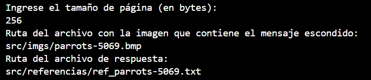

## Ejemplo para probar esconder mensaje en imagen y recuperar mensaje de imagen

### Se debe tener en `source/imgs/` la imagen a usar

### Ejecutando el main

## Ejemplo para probar generacion de archivo con referencias

### Se debe tener en source una imagen

### Ejecutando el main

